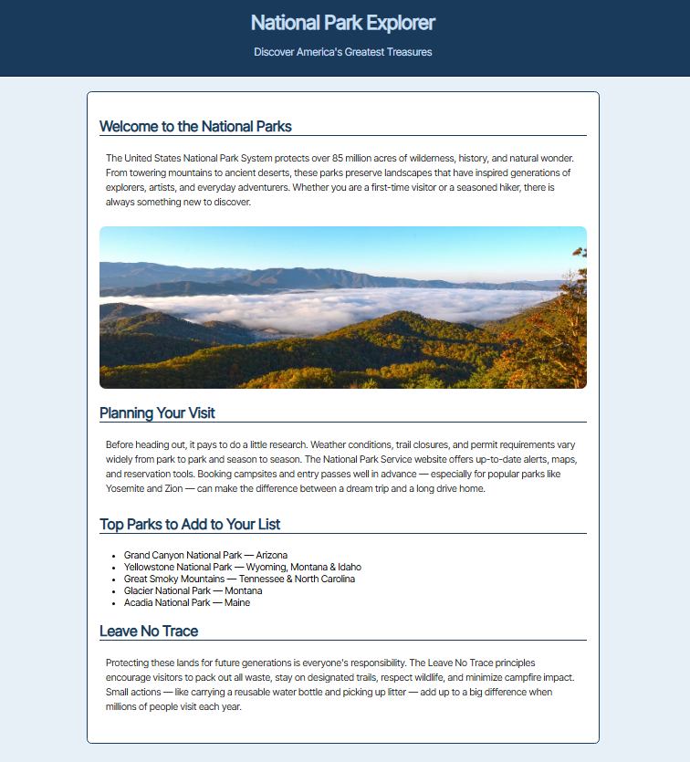

# Midterm Page Construction Instructions

## 0. Target Webpage

Recreate the following page:



## 1. File setup

1. Set the page title to one suitable for this ficitious national parks information website
2. Add a charset meta tag for UTF-8
3. Add an author meta tag with your name
4. Add a description meta tag for this website
5. Complete the comment block at the top with your name, the date, the filename, and the purpose


## 2. Google Font

1. Link the Google Font "Inter Tight" using the preconnect and stylesheet links:

```html
   <link rel="preconnect" href="https://fonts.googleapis.com">
   <link rel="preconnect" href="https://fonts.gstatic.com" crossorigin>
   <link href="https://fonts.googleapis.com/css2?family=Inter+Tight:ital@0;1&display=swap" rel="stylesheet">
```

2. Apply it as the primary font in the body rule, with Verdana, Geneva, and sans-serif as fallbacks

## 3. Page Structure

Inside `<body>`, create two elements:

- A `<header>` with role="banner" containing:
- An `<h1>`: National Park Explorer
- A `<p>` with class "tagline": Discover America's Greatest Treasures

A `<main>` containing one `<section>` with all of the following in order:

- Heading (h2): Welcome to the National Parks - followed by a paragraph of body text
- Image: sourced from https://cdn.pixabay.com/photo/2020/05/09/13/32/great-smoky-moutains-5149679_1280.jpg, with an appropriate alt attribute, with a max width of 100% and lightly rounded corners
- Heading (h2): Planning Your Visit - followed by a paragraph of body text
- Heading (h2): Top Parks to Add to Your List - followed by an unordered list with `aria-label="Recommended national parks"` declaration containing five park entries (use &amp; for any ampersands)
- Heading (h2): Leave No Trace - followed by a paragraph of body text

## 4. Styling: add the following CSS rules:

- body: Use the Inter Tight font stack (see above); background color #e8f0f7; no margins
- h2: Color #1a3a5c; a 2-pixel solid bottom border in #1a3a5c; bottom margin of 0
- header: Background color #1a3a5c, text color #c8dff0, no margins; 10px padding on all sides; a 1-pixel solid bottom border in #0a1f33
- header h1 and the tagline under it: Both centered, top and bottom margins of 0.25em, left/right auto
- header tagline: Font size 1.1em; color #c8dff0
- main > section: White background, 800px wide, margin on the top & bottom comparable to the image, 20px padding; a 1-pixel solid border in #1a3a5c; border slightly rounded
- p: Light padding on all sides; line height 1.5; text color #222222
- ul: Light padding on the top so it appears evenly spaced with the heading above it, comparable to the paragraphs (does it look visually balanced?)


## 5. Script tag - just above the closing </body> tag, add:

```html
<script src='js/w3c.js'></script>
```

## 6. Upload, Validate, Submit!

1. Upload the file to your `userid.csci1210.com/midterm` folder
2. Display your page in a browser
3. Validate your file; fix any errors; and re-upload the fixed file&nbsp;
4. Upload a text file with the URL for your file to the Midterm Dropbox folder on D2L
5. In NPP, press `Ctrl-a` to select all of the text; then `Ctrl+c` to copy it; return here and paste the text into your response here in D2L (replacing the starting code with your completed code)